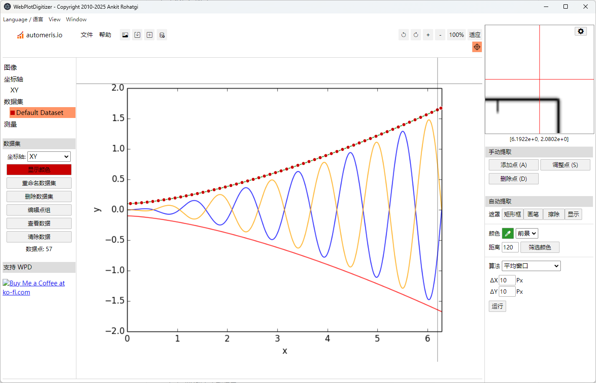

# WebPlotDigitizer 桌面版

[WebPlotDigitizer-Bilingual](https://github.com/chugit/WebPlotDigitizer-Bilingual) 是基于 [WebPlotDigitizer 官方源码](https://github.com/automeris-io/WebPlotDigitizer) 构建的 Windows 中英双语离线桌面版。项目目标是在保留 WebPlotDigitizer 核心功能的基础上，提供一个可在本地运行、支持中文和英文界面、适合科研与工程场景使用的数据提取工具。

本项目不是 WebPlotDigitizer 官方发行版，也不是上游项目的替代品。它主要提供一个面向 Windows 的中文、英文双语离线桌面构建流程，便于用户在本地环境中使用 WebPlotDigitizer 的主要功能。

## WebPlotDigitizer 简介

[WebPlotDigitizer](https://automeris.io/docs/) 是一款用于从图表图片中提取数值数据的工具。很多论文、报告、扫描件、产品手册或历史资料中的数据只以图片形式存在，无法直接复制为表格。WebPlotDigitizer 可以通过坐标轴标定、手动取点和辅助识别等方式，将图像中的曲线、散点、柱状图、地图或测量结果转换为可分析的数字数据。

简单来说，它可以把“图片里的数据”重新转换成“表格里的数据”。

### 主要用途

WebPlotDigitizer 常用于科研、工程、数据分析和资料整理等场景，例如：

- 从论文图表中提取实验曲线、散点图或柱状图数据。
- 从产品手册、技术报告、扫描件中恢复性能曲线或测量结果。
- 将截图、PDF 或扫描图中的图表转换为可编辑、可计算的数据。
- 在没有原始数据文件的情况下，从已有图像中重建可用数据。
- 将提取结果导出为 CSV 等格式，用于 Excel、Python、Origin、MATLAB、R 等工具继续分析。

## 本项目特性

- 基于 [WebPlotDigitizer 官方源码](https://github.com/automeris-io/WebPlotDigitizer) 构建。
- 支持 Windows 桌面端离线运行。
- 提供中文、英文双语界面。
- 保留本地图片加载、坐标轴标定、手动取点、数据导出等核心流程。
- 可通过项目脚本复现构建流程，便于维护和二次调整。

## 实现效果

构建成功后，桌面会生成一个便携式目录：

``` text
WebPlotDigitizer-<version>-bilingual-offline
```

其中 `<version>` 来自上游源码根目录的 `package.json` 。

便携式目录中包含：

``` text
WebPlotDigitizer-Bilingual.exe
resources/
locales/
chrome_*.pak
icudtl.dat
其他 Electron 运行文件
```

同时会在桌面生成两个快捷方式：

``` text
WebPlotDigitizer <version> Chinese
WebPlotDigitizer <version> English
```

应用顶部菜单提供语言切换入口。



## 仓库文件

| 文件 | 用途 |
|------------------------------------|------------------------------------|
| `README.md` | GitHub 项目说明文档 |
| `build_wpd_bilingual_dynamic_ascii.ps1` | Windows PowerShell 构建脚本。脚本内容保持 ASCII-only，避免编码损坏。 |
| `translations.zh_CN.csv` | 中文翻译表。脚本根据该文件生成 `messages.po` 和 `messages.mo`。 |
| `LICENSE` | 本仓库自身内容的许可证 |

## 系统要求

推荐环境：

-   Windows 10 或 Windows 11 x64
-   Windows PowerShell
-   [Git](https://git-scm.com/install/ "Git - Install")
-   [Node.js LTS](https://nodejs.org/en/download "Download Node.js®")
-   [Python](https://www.python.org/downloads/ "Download Python")

从官网安装基础工具，或在 PowerShell 中利用 winget 安装：

``` powershell
winget install -e --id Git.Git
winget install -e --id OpenJS.NodeJS.LTS
winget install -e --id Python.Python.3.12
```

安装完成后，关闭并重新打开 PowerShell，然后检查：

``` powershell
git --version
node -v
npm -v
py --version
```

能正常输出版本号即可。

## 快速开始

### 1. 准备文件

建议在桌面建立一个工作文件夹，如 “WPD双语离线构建”。里面放本仓库的两个文件：

``` text
build_wpd_bilingual_dynamic_ascii.ps1
translations.zh_CN.csv
```

### 2. 设置镜像源，可选但推荐

在中国大陆网络环境下，建议设置 npm、pip 和 Electron 下载镜像。

在 PowerShell 中执行：

``` powershell
npm config set registry https://registry.npmmirror.com
py -m pip config set global.index-url https://pypi.tuna.tsinghua.edu.cn/simple

$env:ELECTRON_MIRROR="https://npmmirror.com/mirrors/electron/"
$env:ELECTRON_CUSTOM_DIR="{{ version }}"

[Environment]::SetEnvironmentVariable("ELECTRON_MIRROR","https://npmmirror.com/mirrors/electron/","User")
[Environment]::SetEnvironmentVariable("ELECTRON_CUSTOM_DIR","{{ version }}","User")
```

### 3. 执行构建

进入构建文件夹，如：

``` powershell
cd "$env:USERPROFILE\Desktop\WPD双语离线构建"
```

运行构建脚本：

``` powershell
Set-ExecutionPolicy -Scope CurrentUser RemoteSigned
Set-ExecutionPolicy -Scope Process Bypass
.\build_wpd_bilingual_dynamic_ascii.ps1
```

构建脚本会自动完成：

1.  创建本地工作目录。
2.  从 WebPlotDigitizer 官方 GitHub 仓库拉取源码。
3.  读取上游 `package.json` 中的 `version`。
4.  安装 Python 与 npm 依赖。
5.  提取 Jinja2 翻译模板。
6.  合并 `translations.zh_CN.csv`。
7.  生成中文 `messages.po` 与 `messages.mo`。
8.  构建 `wpd.min.js`。
9.  渲染英文与中文离线 HTML。
10. 写入 Electron 桌面入口文件。
11. 安装桌面端依赖。
12. 检查或修复 Electron 二进制文件。
13. 生成便携式桌面应用目录。
14. 生成中文和英文两个快捷方式。

## 流程说明

### 翻译文件

`translations.zh_CN.csv` 至少需要包含 `msgid` 和 `msgstr` 两列。推荐完整列结构：

| 字段     | 含义                             |
|----------|----------------------------------|
| `source` | 原文在模板中的来源位置，便于审校 |
| `msgid`  | 英文原文，必须与模板提取结果一致 |
| `msgstr` | 中文译文，不能为空               |
| `note`   | 审校备注，可为空                 |

如果脚本找不到 `translations.zh_CN.csv`，会生成 `translations.zh_CN.to_review.csv` 。自行填写 `msgstr` 列后，另存为 `translations.zh_CN.csv` ，然后重新运行构建脚本。

如果脚本发现有未翻译条目，也会重新生成 `translations.zh_CN.to_review.csv`，并在 `note` 列标记 `MISSING` 。补齐后再次运行即可。

### ASCII-only PowerShell 脚本

`build_wpd_bilingual_dynamic_ascii.ps1` 必须保持 ASCII-only。不要把脚本中的英文提示或注释改成中文。

### 动态版本号

脚本从上游源码根目录读取版本号：

``` powershell
$RootPkg = Get-Content ".\package.json" -Raw | ConvertFrom-Json
$WpdVersion = $RootPkg.version
```

注意：脚本默认拉取上游仓库当前分支的最新代码。因此构建结果会随上游仓库变化。若需要严格可复现构建，应把脚本中的 `git clone --depth 1` 改为指定 commit、tag 或 fork。

### Electron 修复逻辑

如果 npm 安装了 Electron 包，但 Electron 二进制文件没有完整下载，脚本会执行修复逻辑：

1.  读取 `node_modules\electron\package.json` 中的 Electron 版本。
2.  删除损坏的 `dist` 目录和 `path.txt`。
3.  从镜像源或 GitHub Electron Release 下载对应 zip。
4.  解压到 `node_modules\electron\dist`。
5.  写入 `node_modules\electron\path.txt`。

## 结果验证

构建完成后，建议按以下顺序验证：

1.  打开中文快捷方式。
2.  确认窗口标题包含当前版本号和中文离线版标识。
3.  通过顶部菜单切换到 English。
4.  再切回中文。
5.  加载一张本地图片。
6.  完成坐标轴标定。
7.  手动拾取若干数据点。
8.  导出 CSV。
9.  断开网络后重新启动应用。
10. 重复加载、标定、取点、导出流程。

通过以上测试后，可以认为核心离线工作流可用。

## 常见问题

### PowerShell 报“意外的标记 }”

通常不是构建逻辑错误，而是 `.ps1` 文件编码损坏。

处理方式：

1.  重新下载 `build_wpd_bilingual_dynamic_ascii.ps1`。
2.  不要把脚本内容复制到富文本编辑器。
3.  不要把脚本里的英文提示改成中文。
4.  确认脚本保持 ASCII-only。

### Electron failed to install correctly

这是 Electron npm 包安装了，但真正的 Electron 二进制没有完整下载。

本构建脚本会自动执行 `Repair-Electron`。如果仍失败，通常是网络或代理问题。可以检查：

-   `ELECTRON_MIRROR` 是否设置正确。
-   是否能访问 Electron 镜像源。
-   是否能访问 GitHub Release。
-   杀毒软件是否拦截 zip 下载或解压。

### npm deprecated 警告

例如：

``` text
npm warn deprecated glob@7.2.3
npm warn deprecated rimraf@3.0.2
```

这些通常只是依赖包生命周期提示，不等同于构建失败。真正需要处理的是脚本末尾的 `throw`、`failed` 或进程退出码非零。

### 构建时联网，运行时离线

本项目生成的是**运行时离线应用**。构建过程仍需要联网下载：

-   WebPlotDigitizer 上游源码
-   npm 依赖
-   Python 依赖
-   Electron 二进制文件

## 引用方式

```bibtex
@software{WebPlotDigitizer,
  author  = {Rohatgi, Ankit},
  title   = {WebPlotDigitizer},
  url     = {https://automeris.io},
  version = {5.3.0}
}
```

> Rohatgi, A. WebPlotDigitizer, version 5.3.0. https://automeris.io.

```bibtex
@misc{Marin2017WebPlotDigitizer,
  author        = {Marin, Frédéric and Rohatgi, Ankit and Charlot, Stéphane},
  title         = {WebPlotDigitizer, a polyvalent and free software to extract spectra from old astronomical publications: application to ultraviolet spectropolarimetry},
  year          = {2017},
  eprint        = {1708.02025},
  archivePrefix = {arXiv},
  primaryClass  = {astro-ph.IM},
  doi           = {10.48550/arXiv.1708.02025}
}
```
> Marin, F., Rohatgi, A., Charlot, S., 2017. WebPlotDigitizer, a polyvalent and free software to extract spectra from old astronomical publications: Application to ultraviolet spectropolarimetry. arXiv: Instrumentation and Methods for Astrophysics. https://doi.org/10.48550/arXiv.1708.02025.

```bibtex
@software{WebPlotDigitizerBilingual,
  author  = {chugit},
  title   = {WebPlotDigitizer-Bilingual: Windows bilingual offline desktop build workflow for WebPlotDigitizer},
  url     = {https://github.com/chugit/WebPlotDigitizer-Bilingual},
  version = {5.3.0},
  year    = {2026}
}
```

> Chu, J.C., 2026. WebPlotDigitizer-Bilingual. https://github.com/chugit/WebPlotDigitizer-Bilingual.
